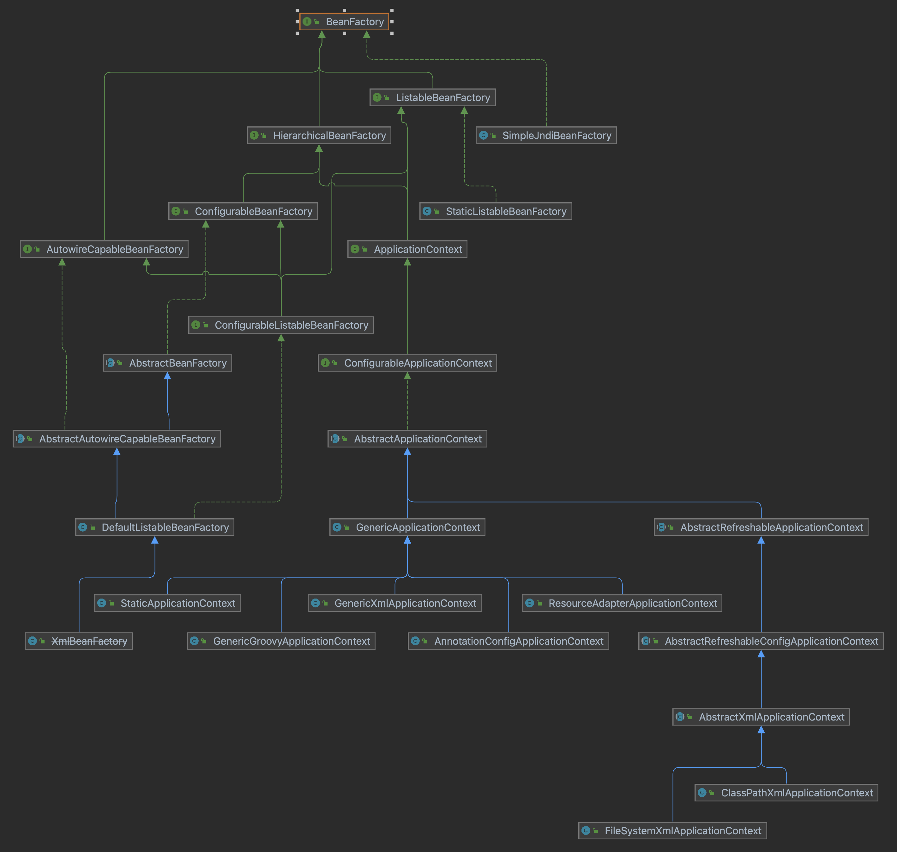

# 一、IOC和原生创建Java对象的区别
- 原生Java创建对象：手动创建对象、组装对象
- IOC：将创建对象、组装对象的步骤交给IOC容器完成

# 二、IOC容器
IOC容器的初始化过程即：初始化IOC容器，并将BeanDefinition放入到IOC容器
## 1 IOC容器的说明
### 1.1 IOC容器层次结构


说明：
- 容器可以分为两类，基于XML文件、基于注解或Java配置
- 当在子容器中查找Bean时，Spring采用以下查找顺序： 首先在当前容器中查找 ；如果未找到，递归向父容器查找 ；直到找到Bean或到达根容器为止


# 三、Bean的生命周期
## 1.Bean的生命周期
### 1.1 阶段
1. **实例化阶段** - Bean对象的创建
2. **属性赋值阶段** - 依赖注入和属性设置
3. **初始化阶段** - Aware接口回调、BeanPostProcessor处理、初始化方法调用
4. **使用阶段** - Bean正常工作，可能涉及AOP代理
5. **销毁阶段** - Bean的清理和资源释放

#### 1.1.1 实例化

说明
- Bean实例化的时机分为两种（懒加载和预加载），如BeanFactory管理的Bean的实例化策略默认是懒加载；ApplicantContext管理的Bean的实例化策略默认是预加载。

实例化的途径
1. **构造函数实例化** - 使用默认构造函数或带参数的构造函数（有参构造函数实例化时，会先创建参数对应的Bean对象）
  - 循环依赖如果是基于构造函数的，则无法解决循环依赖
  - 循环依赖基于属性注入的方式解决，因为在属性赋值阶段，双方所依赖的实例均作为半成品被创建


#### 1.1.2 属性赋值

说明
- 基本类型：按照定义赋初始值或零值
- 引用类型：查找依赖的对象是否纳入容器的管理，如果没有则先初始化依赖的对象

#### 1.1.3 初始化

说明
- 属性赋值阶段之后，不代表Bean可以正常工作，还需要添加业务逻辑的话，则放在初始化阶段

常见操作
- 执行自定义初始化逻辑：如初始化数据库连接池、属性校验等

#### 1.1.4 使用

说明
- 如果Bean需要AOP增强，Spring会在BeanPostProcessor的后置处理阶段创建代理对象

#### 1.1.5 销毁

说明
- 销毁阶段是Bean生命周期的最后阶段，负责清理Bean占用的资源，调用销毁回调方法


### 1.2 关键设计
#### 1.2.1 三级缓存
在Bean的生命周期中，提前暴露一个“不完整”的Bean引用，从而打破循环依赖的僵局，同时保证Singleton Bean的单例性和正确处理AOP代理
- 一级缓存：完全初始化后的Bean
- 二级缓存：存放早期的Bean引用（半成品），用于解决循环依赖
- 三级缓存：存放Bean的ObjectFactory（工厂），用于处理AOP代理等特殊情况


## 2.Bean的生命周期扩展点


### 2.1 BeanFactoryPostProcessor
#### 说明 
- 函数式接口，在Bean实例化之前的操作
- 作用：修改已有的Bean的定义，注册新的Bean

#### 使用场景举例
- ConfigurationClassPostProcessor
  - **作用**: 处理`@Configuration`注解类
  - **功能**: 解析`@Bean`方法、处理`@Import`和`@ComponentScan`
  - **重要性**: Spring Boot自动配置的核心

- PropertyPlaceholderConfigurer
  - **作用**: 处理属性占位符
  - **功能**: 将`${property.name}`替换为实际值
  - **数据源**: Properties文件、系统属性

- PropertySourcesPlaceholderConfigurer
  - **作用**: 基于Environment的属性处理
  - **优势**: 支持多种属性源、Profile机制
  - **推荐**: Spring 3.1+推荐使用


### 2.2 InitiationAwareBeanPostProcessor
#### 说明
- BeanPostProcessor的子接口
- 作用：在Bean的实例化前后以及属性注入阶段进行干预
- 3个关键方法：postProcessBeforeInstantiation()、postProcessAfterInstantiation()、postProcessProperties()
```
### 1. postProcessBeforeInstantiation()

**作用**：
- 在Bean实例化之前执行
- 可以返回一个代理对象来替代正常的Bean实例
- 如果返回非null对象，会跳过正常的实例化流程
- 常用于创建代理对象（如AOP代理）

### 2. postProcessAfterInstantiation()

**作用**：
- 在Bean实例化之后、属性注入之前执行
- 返回boolean值控制是否继续属性注入
- 返回false会跳过属性注入阶段
- 适合进行自定义的字段注入

### 3. postProcessProperties()

**作用**：
- 在属性注入阶段执行
- 可以修改要注入的属性值
- 处理注解驱动的依赖注入（如@Autowired、@Resource）
- 返回修改后的PropertyValues或null
```

#### 使用场景举例
- AutowiredAnnotationBeanPostProcessor


### 2.3 BeanPostProcessor
#### 说明
- 提供了在 Bean 初始化前后进行自定义处理的钩子方法
- 2个关键方法
```
### 1. postProcessBeforeInitialization

- **执行时机**: 在任何Bean初始化回调之前（如 `InitializingBean.afterPropertiesSet()` 或自定义 `init-method`）
- **Bean状态**: Bean已经完成属性注入
- **返回值**: 可以返回原始Bean或包装后的Bean；如果返回 `null`，后续的BeanPostProcessor将不会被调用
- **用途**: 通常用于检查标记接口或为Bean注入特定的依赖

### 2. postProcessAfterInitialization

- **执行时机**: 在任何Bean初始化回调之后
- **Bean状态**: Bean已经完全初始化
- **返回值**: 可以返回原始Bean或包装后的Bean（如代理对象）
- **用途**: 通常用于包装Bean（如创建代理）
```

#### 常见实现类及用途
```
### 1. ApplicationContextAwareProcessor
- **作用**: 为实现了各种 Aware 接口的 Bean 注入相应的依赖
- **处理的接口**: 
  - `ApplicationContextAware`
  - `EnvironmentAware`
  - `ResourceLoaderAware`
  - `ApplicationEventPublisherAware`
  - `MessageSourceAware`

### 2. AutowiredAnnotationBeanPostProcessor
- **作用**: 处理 `@Autowired`、`@Value` 和 `@Inject` 注解的自动注入
- **执行时机**: 主要在 `postProcessProperties` 方法中处理属性注入

### 3. CommonAnnotationBeanPostProcessor
- **作用**: 处理 JSR-250 注解，如 `@Resource`、`@PostConstruct`、`@PreDestroy`
- **功能**: 支持基于注解的依赖注入和生命周期管理

### 4. AsyncAnnotationBeanPostProcessor
- **作用**: 为标注了 `@Async` 的方法创建代理，实现异步执行
- **实现方式**: 通过 AOP 代理包装原始 Bean

### 5. ScheduledAnnotationBeanPostProcessor
- **作用**: 处理 `@Scheduled` 注解，注册定时任务
- **功能**: 扫描并注册带有调度注解的方法
```