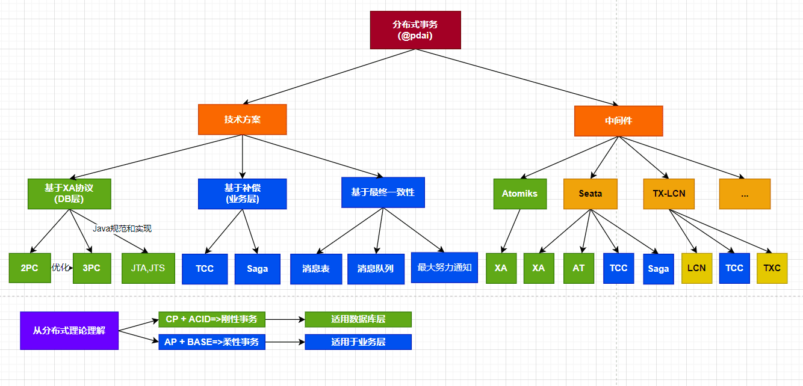
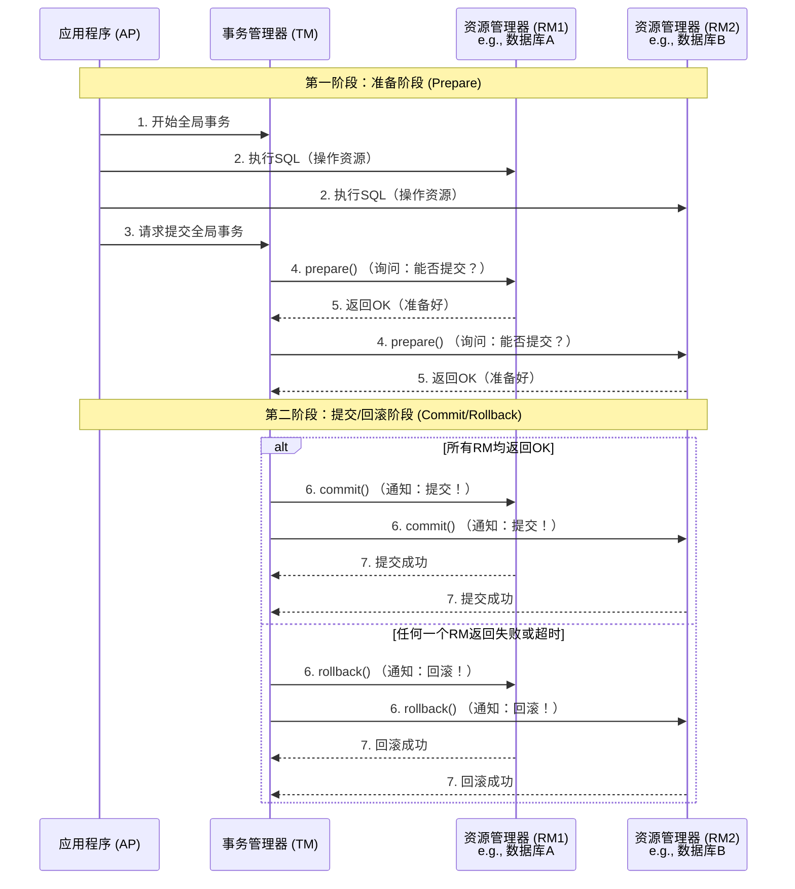

# 分布式事务
## 1.分布式事务理论
分布式事务通常按照CAP理论的范畴分为刚性事务（CP）和柔性事务（AP），并按照技术方案和具体实现有如下说明


## 2.分布式事务技术方案
| 模式简写 | 英文全称 | 中文全称 |
| :--- | :--- | :--- |
| **XA** | **eX**tended **A**rchitecture | **分布式事务架构** |
| **AT** | **A**utomatic **T**ransaction | **自动补偿型事务** |
| **TCC** | **T**ry - **C**onfirm - **C**ancel | **尝试 - 确认 - 取消** |
| **SAGA** | **SAGA** | **长事务模式** (Saga Pattern) |

### 2.1 XA
XA 规范 是 X/Open 组织定义的分布式事务处理（DTP，Distributed Transaction Processing）标准，规定了一个全局事务管理器如何协调多个资源管理器完成一个全局事务；定义了3种角色
- 程序：发起全局事务
- 事务管理器（TM transaction manager）：协调多个资源管理器
- 资源管理器（RM resource manager）：管理RM内部的事务

XA的具体过程是2PC，为了优化2PC的阻塞，有了3PC
- 2PC的具体实现有Atomikos、Bitronix、seata的XA模式
- 3PC虽是优化2PC，但具体实现较少，复杂且优势不突出，一般不用

#### 2.1.1 2PC


优缺点说明

| 优点 | 缺点 |
| :--- | :--- |
| **强一致性**：严格保证了数据的强一致性，是金融等领域的传统标准。 | **同步阻塞**：在第二阶段，所有RM的资源（如数据库行锁）会一直保持锁定，直到TM发出最终指令。这期间其他操作会被阻塞，**性能较差**。 |
| **简单通用**：对应用代码侵入性低（通常只需一个注解`@Transactional`），主流数据库都支持。 | **单点问题**：TM是单点。如果在第二阶段TM宕机，RM会一直处于“不知所措”的状态（阻塞），需要人工干预。 |
| **成熟可靠**：是经过时间检验的工业标准。 | **数据不一致风险**：在极端情况下，如第二阶段TM只发送了部分`commit`指令后就宕机，会导致部分数据已提交，部分数据未提交，产生数据不一致。 |

#### 2.1.2 3PC

三阶段提交的伪代码说明

```java
// 协调者端
public class ThreePhaseCommitCoordinator {
    
    // 第一阶段：CanCommit
    public boolean canCommit() {
        for (Participant p : participants) {
            if (!p.canCommit()) {
                return false;
            }
        }
        return true;
    }
    
    // 第二阶段：PreCommit
    public boolean preCommit() {
        if (canCommit()) {
            for (Participant p : participants) {
                p.preCommit();
            }
            return true;
        } else {
            abort();
            return false;
        }
    }
    
    // 第三阶段：DoCommit
    public void doCommit() {
        for (Participant p : participants) {
            p.doCommit();
        }
    }
}

// 参与者端
public class ThreePhaseCommitParticipant {
    
    public boolean canCommit() {
        // 检查资源是否可用
        return checkResources();
    }
    
    public void preCommit() {
        // 执行事务但不提交
        executeTransaction();
    }
    
    public void doCommit() {
        // 最终提交事务
        commitTransaction();
    }
}
```
3PC是为了解决2PC的阻塞问题和单点问题

| 特性 | 两阶段提交 (2PC) | 三阶段提交 (3PC)                                                                               |
| :--- | :--- |:------------------------------------------------------------------------------------------|
| **阶段数** | **2个阶段**：1. 准备阶段 (CanCommit) <br> 2. 提交/回滚阶段 (DoCommit) | **3个阶段**：1. 询问阶段 (CanCommit) <br> 2. 准备阶段 (PreCommit) <br> 3. 提交/回滚阶段 (DoCommit)          |
| **设计目标** | **强一致性**，简单直接 | **强一致性**，且**减少阻塞**                                                                        |
| **性能与阻塞** | **同步阻塞严重**：参与者在投票后**一直阻塞**，等待协调者的指令，期间资源被锁定。 | **减少阻塞**：引入了超时机制，参与者在一定时间后无响应可自行中止或提交，减少了资源锁定时间。                                          |
| **协调者单点故障** | **影响严重**：<br> - **准备阶段后宕机**：参与者全部阻塞。<br> - **提交阶段中途宕机**：部分参与者可能收到指令，部分没有，导致数据不一致。 | **影响减轻**：<br> - **前两阶段宕机**：参与者超时后自动中止。<br> - **第三阶段中途宕机**：参与者超时后**自动提交**（因为已收到PreCommit）。 |
| **数据一致性** | **强一致性** | **强一致性**                                                                                  |
| **适用场景** | 对**强一致性**要求极高，可以容忍阻塞和性能下降的场景（如传统数据库、金融核心系统）。 | 在2PC的基础上，对**响应速度**要求更高的情况。                                                                |


## 3.分布式事务具体实现
### 3.1 Seata
Seata提供了4种分布式事务的可选模式：XA、AT、TCC、SAGA

对于seat的说明，详见 incubator-seata、incubator-seata-samples项目的提交